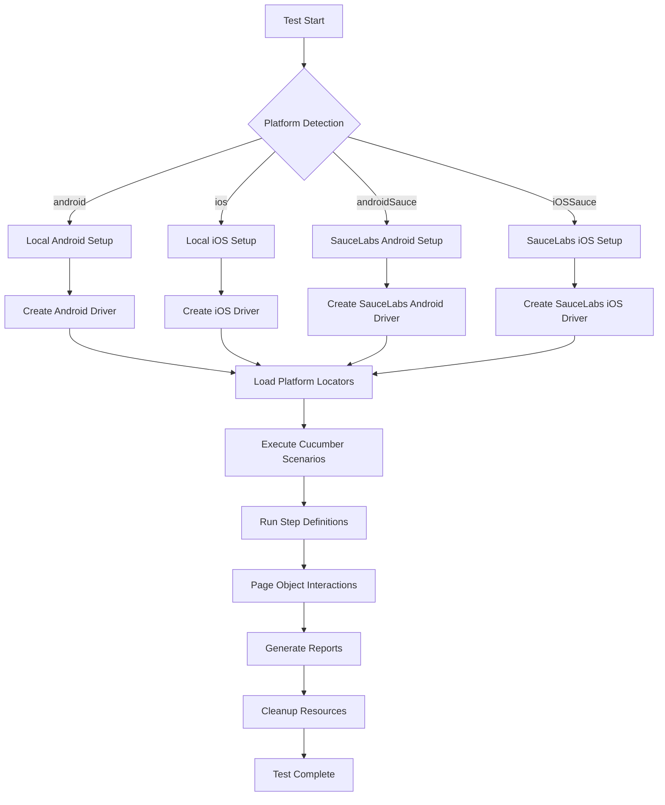

# 📱 SwiftEx Mobile Test Automation Framework

# Track SwiftEx Mobile Test Cases
https://docs.google.com/spreadsheets/d/1s3QgrtJFB_j5VdeQqt7d44Q2dybhtOP5W_j6c5gMBDE/edit?pli=1&gid=0#gid=0

A comprehensive mobile test automation framework supporting both Android and iOS platforms with local execution and SauceLabs cloud testing integration.

## 🚀 Quick Start

### Prerequisites
- Java 17+
- Maven 3.6+
- Node.js (for local Appium server)
- Android SDK (for local Android testing)
- Xcode (for local iOS testing - macOS only)

### Run Tests
```bash
# Android Local
mvn clean test -Dplatform=android -Dcucumber.filter.tags="@createPin"

# Android SauceLabs Cloud
mvn clean test -Dplatform=androidSauce -Dcucumber.filter.tags="@createPin"

# iOS SauceLabs Cloud  
mvn clean test -Dplatform=iOSSauce -Dcucumber.filter.tags="@createPin"
```

## 📋 Table of Contents

1. [Project Architecture](#-project-architecture)
2. [Framework Features](#-framework-features)
3. [Technology Stack](#-technology-stack)
4. [Project Structure](#-project-structure)
5. [Configuration](#-configuration)
6. [Test Execution Flow](#-test-execution-flow)
7. [Page Object Model](#-page-object-model)
8. [Locator Management](#-locator-management)
9. [SauceLabs Integration](#-saucelabs-integration)
10. [GitHub Actions CI/CD](#-github-actions-cicd)
11. [Reporting](#-reporting)
12. [Advanced Features](#-advanced-features)

## 🏗️ Project Architecture

```
┌─────────────────────────────────────────────────────────────────┐
│                    GitHub Actions CI/CD                        │
│  ┌─────────────┐  ┌─────────────┐  ┌─────────────────────────┐  │
│  │Manual Trigger│  │Auto Trigger │  │ Scheduled Runs        │  │
│  │with Inputs  │  │(Push/PR)    │  │ (Nightly)             │  │
│  └─────────────┘  └─────────────┘  └─────────────────────────┘  │
└─────────────────────────────────────────────────────────────────┘
                                │
                                ▼
┌─────────────────────────────────────────────────────────────────┐
│                SwiftEx Test Framework                           │
│                                                                 │
│  ┌─────────────────┐    ┌──────────────────────────────────┐   │
│  │   Test Layer    │    │         Execution Platforms     │   │
│  │                 │    │                                  │   │
│  │ ┌─────────────┐ │    │ ┌─────────┐  ┌─────────────────┐ │   │
│  │ │ Cucumber    │ │    │ │ Local   │  │   SauceLabs     │ │   │
│  │ │ Features    │ │    │ │ Android │  │   Cloud         │ │   │
│  │ │ & Scenarios │ │    │ │ iOS     │  │   Android/iOS   │ │   │
│  │ └─────────────┘ │    │ └─────────┘  └─────────────────┘ │   │
│  │                 │    │                                  │   │
│  │ ┌─────────────┐ │    │ ┌─────────────────────────────┐  │   │
│  │ │ Step        │ │    │ │      Driver Management     │  │   │
│  │ │ Definitions │ │    │ │                             │  │   │
│  │ └─────────────┘ │    │ │ ┌─────────┐ ┌─────────────┐ │  │   │
│  │                 │    │ │ │Android  │ │iOS Driver   │ │  │   │
│  │ ┌─────────────┐ │    │ │ │Driver   │ │Management   │ │  │   │
│  │ │ Test Hooks  │ │    │ │ └─────────┘ └─────────────┘ │  │   │
│  │ │ & Context   │ │    │ └─────────────────────────────┘  │   │
│  │ └─────────────┘ │    └──────────────────────────────────┘   │
│  └─────────────────┘                                          │
│                                                                 │
│  ┌─────────────────────────────────────────────────────────┐   │
│  │              Page Object Layer                          │   │
│  │                                                         │   │
│  │ ┌─────────────┐  ┌────────────┐  ┌──────────────────┐  │   │
│  │ │  Base Page  │  │  PIN Page  │  │ Other Pages...   │  │   │
│  │ │  Framework  │  │  Object    │  │                  │  │   │
│  │ └─────────────┘  └────────────┘  └──────────────────┘  │   │
│  │                                                         │   │
│  │ ┌─────────────────────────────────────────────────────┐ │   │
│  │ │           Locator Management System                 │ │   │
│  │ │                                                     │ │   │
│  │ │ ┌──────────────┐           ┌──────────────────────┐ │ │   │
│  │ │ │Android YAML  │           │iOS YAML Locators    │ │ │   │
│  │ │ │Locators      │           │                      │ │ │   │
│  │ │ └──────────────┘           └──────────────────────┘ │ │   │
│  │ └─────────────────────────────────────────────────────┘ │   │
│  └─────────────────────────────────────────────────────────┘   │
│                                                                 │
│  ┌─────────────────────────────────────────────────────────┐   │
│  │              Utility & Configuration Layer              │   │
│  │                                                         │   │
│  │ ┌─────────────┐ ┌─────────────┐ ┌─────────────────────┐ │   │
│  │ │Config       │ │Element      │ │Test Context &       │ │   │
│  │ │Loader       │ │Actions      │ │Reporting Utils      │ │   │
│  │ └─────────────┘ └─────────────┘ └─────────────────────┘ │   │
│  └─────────────────────────────────────────────────────────┘   │
└─────────────────────────────────────────────────────────────────┘
                                │
                                ▼
┌─────────────────────────────────────────────────────────────────┐
│                    Reporting & Artifacts                       │
│                                                                 │
│  ┌─────────────┐  ┌─────────────┐  ┌─────────────────────────┐  │
│  │   Allure    │  │  Surefire   │  │    Screenshots &       │  │
│  │  Reports    │  │  Reports    │  │    Test Artifacts      │  │
│  └─────────────┘  └─────────────┘  └─────────────────────────┘  │
└─────────────────────────────────────────────────────────────────┘
```

## ✨ Framework Features

### 🎯 Core Capabilities
- **Cross-Platform Testing**: Android and iOS support
- **Cloud Testing**: SauceLabs integration with custom test naming
- **Local Testing**: Local device/emulator support
- **BDD Framework**: Cucumber integration with Gherkin syntax
- **Page Object Model**: Maintainable and reusable page objects
- **Smart Locator System**: Platform-specific YAML-based locators
- **Parallel Execution**: Multi-thread test execution support
- **Rich Reporting**: Allure reports with screenshots and detailed steps

### 🔧 Advanced Features
- **Dynamic Platform Switching**: Runtime platform selection
- **Intelligent Element Handling**: Retry mechanisms and smart waits
- **Test Context Management**: Thread-safe test data management
- **Custom Test Naming**: Meaningful test names in SauceLabs dashboard
- **Comprehensive Logging**: Structured logging with SLF4J
- **CI/CD Ready**: GitHub Actions integration with manual triggers

## 🛠️ Technology Stack

| Component | Technology | Version | Purpose |
|-----------|------------|---------|---------|
| **Language** | Java | 17+ | Core programming language |
| **Build Tool** | Maven | 3.6+ | Dependency management & build |
| **Test Framework** | JUnit 5 | 5.10.0 | Test execution engine |
| **BDD Framework** | Cucumber | 7.14.0 | Behavior-driven development |
| **Mobile Automation** | Appium | 8.5.1 | Mobile app automation |
| **WebDriver** | Selenium | 4.13.0 | WebDriver implementation |
| **Cloud Platform** | SauceLabs | - | Cloud testing platform |
| **Reporting** | Allure | 2.24.0 | Rich test reporting |
| **Logging** | SLF4J + Logback | 2.0.9 | Structured logging |
| **YAML Processing** | SnakeYAML | 2.2 | Configuration management |
| **CI/CD** | GitHub Actions | - | Continuous integration |

## 📁 Project Structure

```
swiftExMobileApp/
├── 📁 src/
│   ├── 📁 main/java/com/swiftEx/mobileAutomationFramework/
│   │   ├── 📁 driver/
│   │   │   ├── 🔧 DriverFactory.java          # Driver management & creation
│   │   │   └── 🔧 MinimalDriverFactory.java   # Lightweight driver factory
│   │   ├── 📁 pages/
│   │   │   ├── 🏗️ BasePage.java               # Base page object framework
│   │   │   └── 📱 PinCreationPage.java        # PIN creation page object
│   │   └── 📁 utils/
│   │       ├── ⚙️ ConfigLoader.java           # Configuration management
│   │       ├── 🎯 PlatformConfig.java         # Platform-specific configs
│   │       ├── 📍 LocatorLoader.java          # YAML locator loader
│   │       ├── 🔄 ElementActions.java         # Element interaction utilities
│   │       ├── 📊 AllureUtils.java            # Allure reporting utilities
│   │       └── 🧪 TestContext.java            # Test context management
│   └── 📁 test/
│       ├── 📁 java/com/swiftEx/mobileAutomationFramework/
│       │   ├── 📁 steps/
│       │   │   ├── 🔗 Hooks.java              # Test lifecycle hooks
│       │   │   └── 📋 PinCreationStep.java    # Step definitions
│       │   └── 📁 runner/
│       │       └── 🚀 TestRunner.java         # Test execution runner
│       └── 📁 resources/
│           ├── 📄 framework.properties        # Main configuration
│           ├── 📁 features/
│           │   └── 📋 pinCreation.feature     # BDD test scenarios
│           ├── 📁 locators/
│           │   ├── 📁 android/
│           │   │   └── 📍 pinCreation.yaml    # Android locators
│           │   └── 📁 ios/
│           │       └── 📍 pinCreation.yaml    # iOS locators
│           └── 📁 apps/
│               ├── 📁 android/
│               │   └── 📱 android.apk         # Android test app
│               └── 📁 ios/
│                   ├── 📱 ios.app/            # iOS simulator app
│                   └── 📦 ios_simulator.zip   # iOS app package
├── 📁 .github/workflows/
│   ├── 🔄 mobile-tests.yml                   # Comprehensive CI/CD pipeline
│   └── ⚡ manual-test.yml                    # Manual trigger workflow
├── 📄 pom.xml                                # Maven configuration
└── 📖 README.md                              # This documentation
```

## ⚙️ Configuration

### Main Configuration (`framework.properties`)

```properties
# Platform Configuration
platformName=Android
appium.deviceName=Android Emulator
appium.platformVersion=12
appium.automationName=UiAutomator2

# SauceLabs Configuration
saucelabs.username=oauth-your-username
saucelabs.accessKey=your-access-key
saucelabs.url=https://ondemand.eu-central-1.saucelabs.com:443/wd/hub

# Android SauceLabs
saucelabs.android.deviceName=Google Pixel 4 GoogleAPI Emulator
saucelabs.android.platformVersion=12.0
saucelabs.android.app=sauce-storage:android.apk

# iOS SauceLabs  
saucelabs.ios.deviceName=iPhone 14 Simulator
saucelabs.ios.platformVersion=16.2
saucelabs.ios.app=sauce-storage:ios_simulator.zip
```

### Runtime Parameters

| Parameter | Description | Example |
|-----------|-------------|---------|
| `-Dplatform` | Target platform | `android`, `ios`, `androidSauce`, `iOSSauce` |
| `-Dcucumber.filter.tags` | Test tags to execute | `@createPin`, `@smoke`, `@pinValidationFailed` |
| `-Dandroid.device.name` | Android device name | `"emulator-5554"`, `"Google Pixel 4"` |
| `-Dios.device.name` | iOS device name | `"iPhone 14 Simulator"` |
| `-DfailIfNoTests` | Fail if no tests found | `false` |

## 🔄 Test Execution Flow



### Detailed Flow Description

1. **Test Initialization** (`Hooks.java`)
   - Scenario context setup with `TestContext`
   - Driver creation via `DriverFactory`
   - Platform-specific configuration loading

2. **Driver Management** (`DriverFactory.java`)
   - Platform detection and validation
   - Capability building with platform-specific settings
   - SauceLabs authentication and session creation
   - Local Appium server connection

3. **Page Object Creation** (`BasePage.java`)
   - YAML locator file loading
   - Platform-specific element mapping
   - Element action initialization

4. **Test Execution** 
   - Cucumber scenario parsing
   - Step definition execution
   - Page object method invocation
   - Element interactions with retry logic

5. **Cleanup & Reporting**
   - Driver session termination
   - Test context cleanup
   - Report generation (Allure, Surefire)
   - Artifact collection

## 📱 Page Object Model

### Architecture Design

The framework uses a sophisticated Page Object Model with several key components:

#### BasePage Foundation
```java
public abstract class BasePage {
    protected final AppiumDriver driver;
    protected final String platform;
    protected final Map<String, Object> locators;
    protected final ElementActions elementActions;
    
    // Automatic locator loading from YAML
    public BasePage(AppiumDriver driver, String locatorFile) {
        this.locators = LocatorLoader.loadLocators(locatorFile, platform);
        // ... initialization
    }
    
    // Smart element retrieval
    protected By getBy(String locatorKey) {
        return LocatorLoader.getBy(locators, locatorKey);
    }
}
```

#### PIN Creation Page Example
```java
public class PinCreationPage extends BasePage {
    
    public PinCreationPage(AppiumDriver driver) {
        super(driver, "pinCreation.yaml");  // Auto-loads platform locators
    }
    
    public void enterPIN(String pin) {
        for (char digit : pin.toCharArray()) {
            click("digit_" + digit);  // Uses YAML locators
        }
    }
    
    public String getErrorMessage() {
        return elementActions.getText(getBy("error_message"));
    }
}
```

### Key Features

- **Automatic Locator Loading**: YAML files loaded based on platform
- **Smart Element Handling**: Retry logic and intelligent waits
- **Platform Abstraction**: Same API works across Android/iOS
- **Maintainable Design**: Locators externalized in YAML files

## 🎯 Locator Management

### YAML-Based Locator System

The framework uses platform-specific YAML files for element locators:

#### Android Locators (`android/pinCreation.yaml`)
```yaml
error_message:
  strategy: id
  value: com.app.swiftEx.app:id/snackbar_text

digit_1:
  strategy: xpath  
  value: //android.view.ViewGroup[@content-desc="1"]

create_wallet_button:
  strategy: xpath
  value: //android.widget.Button[contains(@text,'CREATE A NEW WALLET')]
```

#### iOS Locators (`ios/pinCreation.yaml`)
```yaml
error_message:
  strategy: accessibility_id
  value: "error-message"
  fallback_xpath: "//XCUIElementTypeStaticText[contains(@value,'did not match')]"

digit_1:
  strategy: accessibility_id
  value: "digit-1"
  fallback_xpath: "//XCUIElementTypeButton[@name='1' or @label='1']"

create_wallet_button:
  strategy: accessibility_id
  value: "create-wallet-button"
  fallback_xpath: "//XCUIElementTypeButton[@name='CREATE A NEW WALLET']"
```

### Locator Loading Process

1. **Platform Detection**: Framework identifies current platform
2. **File Loading**: Appropriate YAML file loaded (`android/` or `ios/`)
3. **Locator Parsing**: YAML parsed into `Map<String, Object>` structure
4. **By Object Creation**: Locators converted to Selenium `By` objects
5. **Fallback Support**: iOS supports multiple locator strategies

### Benefits

- **Platform Isolation**: Separate locators for each platform
- **Easy Maintenance**: Non-technical users can update locators
- **Multiple Strategies**: iOS supports primary + fallback locators
- **Version Control**: YAML changes tracked in Git

## ☁️ SauceLabs Integration

### Architecture Overview

The framework provides seamless SauceLabs cloud testing integration with advanced features:

#### Key Components

1. **Authentication Management**
   ```java
   // Environment variable support
   String username = System.getProperty("saucelabs.username", 
                    System.getenv("SAUCELABS_USERNAME"));
   ```

2. **Platform-Specific Configuration**
   ```java
   if (platform.equals("androidSauce")) {
       capabilities.setProperty("deviceName", 
           ConfigLoader.getProperty("saucelabs.android.deviceName"));
   }
   ```

3. **Custom Test Naming**
   ```java
   // Uses actual scenario names instead of timestamps
   String testName = TestContext.getFormattedTestName();
   sauceOptions.put("name", testName);
   ```

### Supported Devices

#### Android Devices
- Google Pixel 4 GoogleAPI Emulator (Android 12.0)
- Google Pixel 6 GoogleAPI Emulator (Android 13.0)
- Samsung Galaxy S22 GoogleAPI Emulator (Android 12.0)

#### iOS Simulators  
- iPhone 14 Simulator (iOS 16.2)
- iPhone 13 Simulator (iOS 15.0, 16.0)
- iPad Pro 12.9" Simulator (iOS 16.2)

### Test Session Features

- **Custom Test Names**: Shows "Create PIN: PIN Validation" instead of timestamps
- **Tagging System**: Automatic tags (`swiftex`, `mobile`, `automation`, `android/ios`)
- **Build Grouping**: Tests grouped by build number for easy tracking
- **Session Cleanup**: Automatic session termination and cleanup

## 🚀 GitHub Actions CI/CD

### Workflow Architecture

The framework includes sophisticated CI/CD pipelines with manual trigger support:

#### Main Workflow (`mobile-tests.yml`)

```yaml
name: SwiftEx Mobile Test Automation

on:
  workflow_dispatch:
    inputs:
      platform:
        description: '🤖 Select Test Platform'
        required: true
        default: 'androidSauce'
        type: choice
        options:
          - androidSauce
          - iOSSauce  
          - android
          - ios
      
      test_tags:
        description: 'Cucumber Tags'
        required: true
        default: '@createPin'
        type: choice
        options:
          - '@createPin'
          - '@pinValidationSuccess'
          - '@pinValidationFailed'
          - '@smoke'
```

### Manual Trigger Interface

Users can run tests through GitHub Actions UI with these options:

| Input | Type | Options | Description |
|-------|------|---------|-------------|
| Platform | Choice | `androidSauce`, `iOSSauce`, `android`, `ios` | Test execution platform |
| Test Tags | Choice | `@createPin`, `@smoke`, etc. | Cucumber tags to execute |
| SauceLabs Device | Choice | `Google Pixel 4`, `iPhone 14` | Cloud testing device |
| Platform Version | Choice | `12.0`, `16.2`, etc. | OS version |
| Environment | Choice | `dev`, `staging`, `prod` | Target environment |
| Generate Reports | Boolean | `true`/`false` | Enable Allure reporting |

### Execution Flow

1. **Input Validation**: User inputs validated and processed
2. **Environment Setup**: JDK 17, Maven, dependencies installed  
3. **Platform Configuration**: Dynamic command building based on inputs
4. **Test Execution**: Maven test command with platform-specific parameters
5. **Report Generation**: Allure reports generated automatically
6. **Artifact Upload**: Test results, reports, screenshots uploaded
7. **Status Reporting**: Results posted as PR comments

### Advanced CI/CD Features

- **Parallel Matrix Builds**: Multiple platform/tag combinations
- **Nightly Comprehensive Testing**: Scheduled complete test runs
- **Failure Handling**: Tests continue even if some scenarios fail
- **Smart Caching**: Maven dependencies cached for faster builds
- **Multi-Environment Support**: Development, staging, production testing

## 📊 Reporting

### Allure Integration

The framework generates comprehensive Allure reports with:

#### Features
- **Test Execution Timeline**: Visual representation of test duration
- **Step-by-Step Details**: Each test step with timing information
- **Screenshots on Failure**: Automatic screenshot capture
- **Environment Information**: Platform, device, version details
- **Trend Analysis**: Historical test execution trends
- **Categorization**: Tests organized by features and tags

#### Report Structure
```
Allure Report/
├── 📊 Overview Dashboard
├── 📋 Test Suites (by Feature)
├── 🏷️ Test Categories (by Tags)  
├── 📈 Timeline View
├── 📱 Environment Details
└── 📸 Screenshots & Attachments
```

### Additional Reporting

- **Surefire Reports**: Standard Maven test reports
- **Console Logs**: Detailed execution logs with timestamps
- **GitHub Actions Summaries**: Test results in workflow summary
- **PR Comments**: Automated test result comments on pull requests

## 🔧 Advanced Features

### Test Context Management

The framework includes sophisticated test context handling:

```java
public class TestContext {
    private static final ThreadLocal<String> scenarioName = new ThreadLocal<>();
    private static final ThreadLocal<String> featureName = new ThreadLocal<>();
    private static final ThreadLocal<String[]> tags = new ThreadLocal<>();
    
    public static String getFormattedTestName() {
        String feature = getFeatureName();
        String scenario = getScenarioName();
        return feature + ": " + scenario;
    }
}
```

#### Benefits
- **Thread Safety**: Supports parallel test execution
- **Context Isolation**: Each test maintains independent context  
- **Custom Naming**: Meaningful test names in reporting
- **Memory Management**: Automatic cleanup prevents memory leaks

### Smart Element Handling

The framework provides intelligent element interaction:

```java
public class ElementActions {
    public void clickWithRetry(By locator, int maxRetries) {
        for (int i = 0; i < maxRetries; i++) {
            try {
                WebElement element = waitForElement(locator, 10);
                element.click();
                return;
            } catch (Exception e) {
                if (i == maxRetries - 1) throw e;
                waitBetweenRetries();
            }
        }
    }
}
```

#### Features
- **Retry Logic**: Automatic retries for flaky elements
- **Smart Waits**: Intelligent waiting strategies
- **Exception Handling**: Graceful error recovery
- **Performance Optimization**: Efficient element location

### Dynamic Platform Switching

The framework supports runtime platform switching:

```bash
# Switch platforms without code changes
mvn test -Dplatform=android          # Local Android
mvn test -Dplatform=androidSauce     # Cloud Android
mvn test -Dplatform=ios             # Local iOS  
mvn test -Dplatform=iOSSauce        # Cloud iOS
```

## 🚨 Troubleshooting

### Common Issues & Solutions

| Issue | Cause | Solution |
|-------|-------|----------|
| Driver creation failed | Missing dependencies | Install Android SDK/Xcode |
| SauceLabs authentication error | Wrong credentials | Check `SAUCELABS_USERNAME` and `SAUCELABS_ACCESS_KEY` |
| iOS simulator build error | Wrong app build type | Use simulator build, not device build |
| Locator not found | Missing YAML entry | Add locator to appropriate YAML file |
| GitHub Actions manual trigger not visible | Workflow file issues | Check YAML syntax and push to correct branch |

### Debug Commands

```bash
# Verbose Maven execution
mvn test -X -Dplatform=androidSauce

# Skip tests compilation check
mvn test -DfailIfNoTests=false

# Generate verbose Allure report
mvn allure:serve -Dallure.results.directory=target/allure-results
```

## 🤝 Contributing

### Development Workflow

1. **Fork the repository**
2. **Create feature branch**: `git checkout -b feature/new-feature`
3. **Add tests**: Ensure new features have corresponding tests
4. **Update documentation**: Update README.md for significant changes
5. **Submit pull request**: Include description of changes

### Code Standards

- **Java Code Style**: Follow Google Java Style Guide
- **YAML Format**: Use 2-space indentation
- **Commit Messages**: Use conventional commits format
- **Documentation**: Update relevant documentation for changes

## 📞 Support

### Resources

- **GitHub Issues**: Report bugs and request features
- **Wiki**: Additional documentation and examples  
- **SauceLabs Docs**: https://docs.saucelabs.com/mobile-apps/
- **Appium Guide**: https://appium.io/docs/

### Getting Help

1. Check existing GitHub issues
2. Review troubleshooting section
3. Create detailed issue with:
   - Platform and version
   - Error messages
   - Steps to reproduce
   - Expected vs actual behavior

---

## 🎉 Conclusion

The SwiftEx Mobile Test Automation Framework provides a robust, scalable solution for mobile application testing across multiple platforms and environments. With its advanced features like SauceLabs integration, intelligent locator management, and comprehensive CI/CD pipeline, it enables teams to deliver high-quality mobile applications with confidence.

### Key Achievements
- ✅ **Cross-Platform Testing**: Unified framework for Android and iOS
- ✅ **Cloud Integration**: Seamless SauceLabs integration with custom naming
- ✅ **CI/CD Ready**: GitHub Actions with manual trigger support
- ✅ **Maintainable Architecture**: YAML-based locators and page objects
- ✅ **Rich Reporting**: Allure integration with screenshots and detailed steps
- ✅ **Developer Experience**: Easy setup, comprehensive documentation, troubleshooting guides

**Happy Testing!** 🚀📱